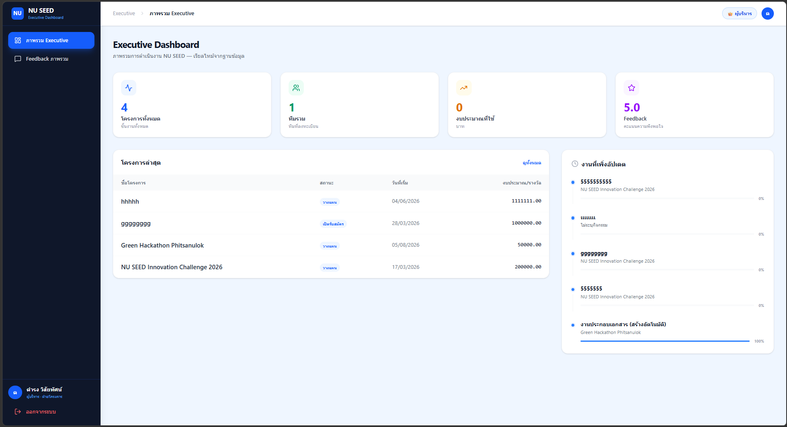
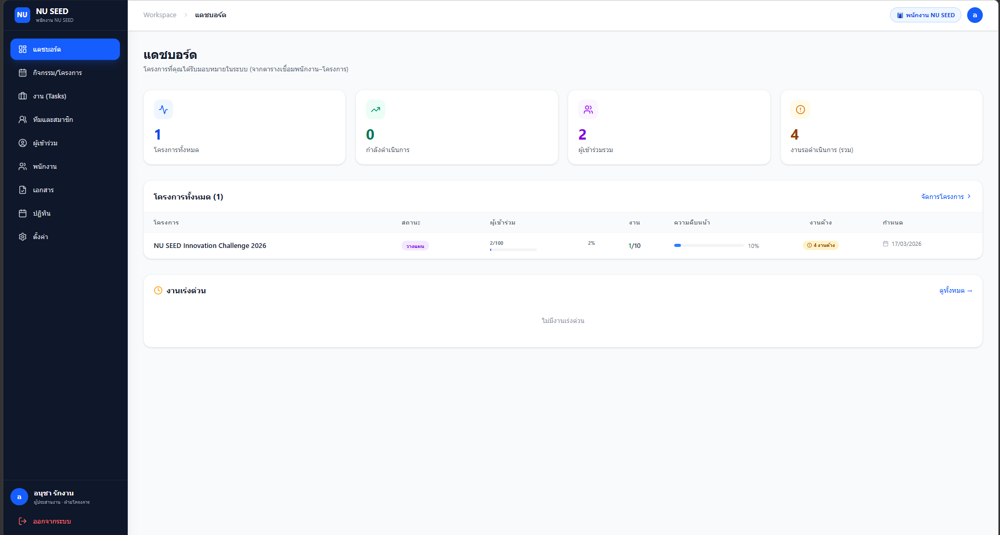
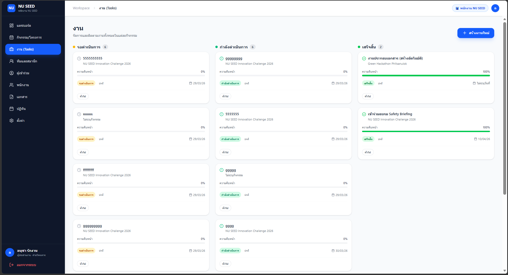
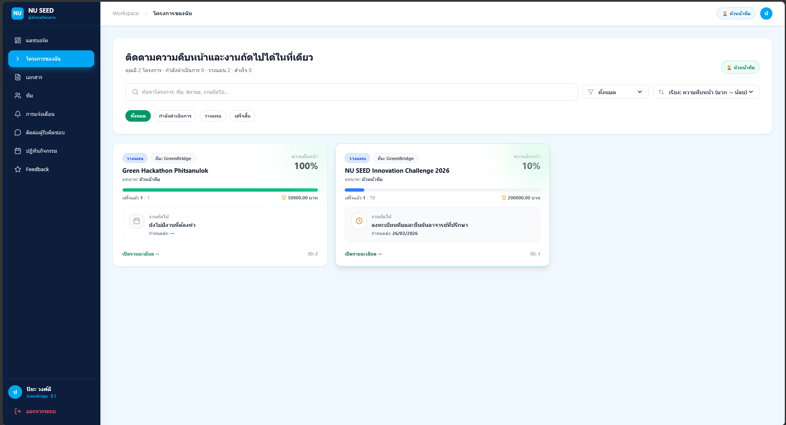
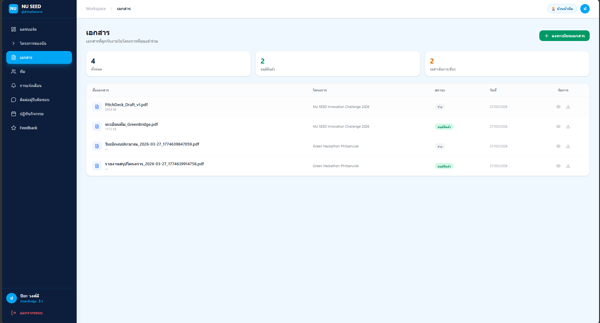
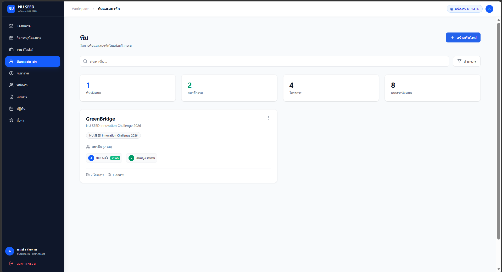
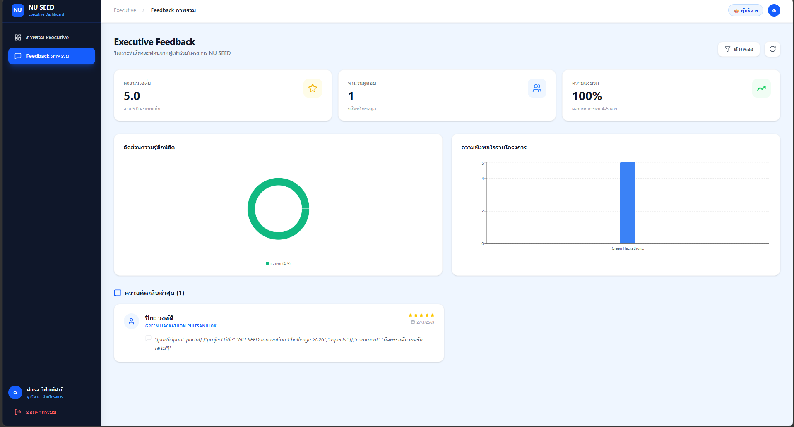

# NU SEED — Event & Participant Management System

A multi-role web application for managing university events, tasks, participant teams, documents, and feedback. Built for Naresuan University.


---

## Overview

NU SEED provides three role-specific portals — Executive, Employee, and Participant — each with a distinct workflow around university events and projects. The system covers event creation and tracking, event-scoped task management, participant team registration, document upload and verification, post-event feedback collection, and an executive KPI view.

---

## Platform Showcase

<div align="center">
  
</div>

| Employee Dashboard | Task Board |
|:-:|:-:|
|  |  |

| Participant Projects | Document Upload |
|:-:|:-:|
|  |  |

| Team Management | Feedback Reports |
|:-:|:-:|
|  |  |

---

## Key Features

- University event creation, editing, and status tracking (dates, budget, capacity)
- Event-scoped task tracking with status, priority, and progress percentage
- Participant team management linked to events
- Document upload by participants; status verification (draft / pending / approved) by employees; multer-based handler with filename sanitisation and 20 MB limit
- Participant feedback with 1–5 rating and comment; aggregated on the executive dashboard
- Employee and staff management (add, edit, delete)
- Calendar and notification views for participants and employees

---

## Role Workflows

| Role | Portal | Access |
|------|--------|--------|
| **Executive** | `/executive/*` | Read-only: event KPIs, total budget, aggregated feedback |
| **Employee** | `/employee/*` | Full management of events, tasks, teams, participants, documents, staff, calendar |
| **Participant** | `/participant/*` | View projects and tasks, upload documents, view team, submit feedback, calendar, notifications |

---

## Tech Stack

| Layer | Technology |
|-------|-----------|
| Frontend | React 19, React Router 7, Vite 7, Recharts |
| Styling | Tailwind CSS v4, Lucide Icons |
| Backend | Node.js, Express 5 |
| Database client | pg (node-postgres) |
| File uploads | multer |
| Password hashing | bcryptjs |
| Database | PostgreSQL 16 (Docker) |

---

## Architecture

```
┌─────────────────────────────────────────────────────┐
│                    Frontend (React + Vite)           │
│  ┌──────────┐  ┌──────────┐  ┌───────────────────┐  │
│  │  Pages   │  │ Contexts │  │    Components     │  │
│  └────┬─────┘  └────┬─────┘  └───────────────────┘  │
│       └──────┬───────┘                               │
│              ▼                                       │
│          fetch / Axios API Client                    │
└──────────────┬───────────────────────────────────────┘
               │
               ▼
┌─────────────────────────────────────────────────────┐
│              Backend (Express 5)                    │
│  ┌──────────┐  ┌──────────┐                         │
│  │  Routes  │  │ Services │                         │
│  └────┬─────┘  └────┬─────┘                         │
│       └─────────────┘                               │
│                     ▼                               │
│                pg (node-postgres)                   │
└─────────────────────┬───────────────────────────────┘
                      │
                      ▼
┌─────────────────────────────────────────────────────┐
│             PostgreSQL 16 (Docker)                  │
│    Events, Tasks, Teams, Participants, Documents     │
└─────────────────────────────────────────────────────┘
```

Docker runs PostgreSQL only. The backend and frontend run as local Node.js processes.

The database schema (`database/se.sql`) defines 26 tables: core entities (`events`, `tasks`, `teams`, `participant_profiles`, `employees`, `documents`, `feedbacks`), lookup tables for statuses, priorities, and roles, and junction tables (`mapping_event_teams`, `mapping_event_employees`, `mapping_doc_tasks`). Migrations in `backend/migrations/` are applied automatically at startup.

---

## Authentication & Authorization

Login is handled by `POST /api/auth/login`. Passwords are verified against bcrypt hashes in the database (bcryptjs, cost factor 10). Employees and executives authenticate by email; participants currently authenticate by firstname. On success the server returns a JSON payload — no token is issued. Client session state is stored in browser `localStorage`.

Frontend route guards in `App.jsx` enforce portal separation, redirecting each role to its own workspace. Backend API routes currently do not enforce authenticated user identity. This is a known limitation of the current implementation.

---

## Local Setup

**Prerequisites:** Node.js 18+, Docker Desktop

**Quick start — Unix / WSL2 / Git Bash:**

```bash
git clone https://github.com/Nokpednam/nu-seed-facility-management.git
cd nu-seed-facility-management
./start.sh        # starts Docker, installs deps, seeds DB, runs both servers
```

**Manual setup:**

```bash
docker compose up -d          # PostgreSQL on port 55432

cd backend
cp .env.example .env
npm install
node scripts/init-demo-db.js  # creates schema, runs migrations, seeds demo data
npm run start                 # API on port 5000

cd ../frontend
cp .env.example .env
npm install
npm run dev                   # Vite dev server on port 5173
```

**Demo accounts** — created by `init-demo-db.js` for local development only (password: `password123`):

| Role | Login field | Value |
|------|-------------|-------|
| Executive | Email | `exec@demo.nu.seed` |
| Employee | Email | `somchai@demo.nu.seed` |
| Employee | Email | `anucha@demo.nu.seed` |
| Participant | Firstname | `ปิยะ` (email: `piya@demo.nu.seed`) |
| Participant | Firstname | `สมหญิง` (email: `somying@demo.nu.seed`) |

Reset demo data: `cd backend && NU_SEED_FORCE_DEMO=1 npm run init-demo-db`

---

Natthawut Wanma — [@Nokpednam](https://github.com/Nokpednam)
